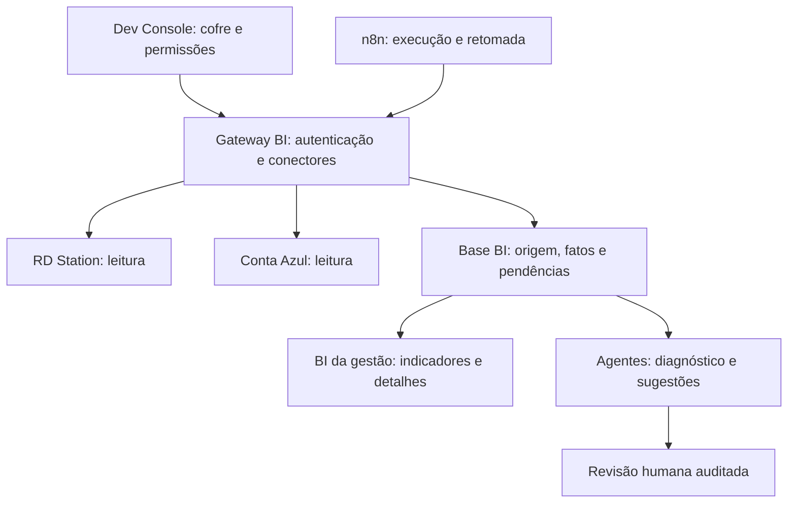

# Sra. Luck BI — arquitetura e contrato de entrega

Data: 29/09/2026. Classificação: NOVO. Solicitante: responsável pelo sistema.

## Estado real desta entrega

Implementado nesta branch: grupo exclusivo `bi` no cofre do Dev Console, com configuração persistida pelo endpoint existente, criptografia, permissões e auditoria existentes. A tela diferencia cadastro de configuração de conexão validada.

Desenhado abaixo, ainda NÃO implementado: OAuth do BI, banco analítico, coletores, workflows n8n, agentes, indicadores e dashboards. Nenhuma migração aplicada, nenhuma coleta disparada e nenhuma credencial copiada. Não se deve anunciar o BI como operacional.

## Objetivo

BI interno profissional, acessível à gestão dentro do sistema, para marketing, SDR, comercial, financeiro e qualidade dos dados. Não depende do Microsoft Power BI. O Dev Console controla conexões e operação técnica; a gestão consulta o BI no ambiente administrativo. A cliente não tem acesso ao BI.

Precisão é comprovada por reconciliação, regras versionadas e rastreabilidade. Não prometer ausência absoluta de erro. Ausência de preenchimento no CRM continua visível como pendência; IA não preenche fatos desconhecidos para melhorar números.

## Separação dos fluxos

- RD → pré-cadastro de clientes é um fluxo operacional existente; preservá-lo durante a implementação do BI. O BI não pode depender da fila de vendas elegíveis à importação de clientes para contar todos os leads.
- Conta Azul → parcelas do app é outra integração operacional, com aprovação e conciliação próprias. Consultar a Conta Azul para o BI não dá baixa em parcela do app.
- O módulo BI controla seus cursores, lotes, regras e falhas independentemente desses dois fluxos.
- Configurações, consentimento e rotação dos conectores somente pelo Dev Console. O n8n não vira uma segunda tela de configuração de negócio.
- Preferência: gateway guarda OAuth e renovações; n8n usa identidade de máquina restrita aos jobs BI. Não entregar tokens de provedores ao navegador, à IA ou aos nós Code do n8n.
- Conexão lógica separada não autoriza duplicar um refresh token rotativo em dois renovadores. Usar consentimento independente se o provedor suportar; caso contrário, um único broker de tokens com autorização separada por finalidade. Confirmar isso no consentimento real antes de ativar.
- Banco analítico com schema, papéis e retenção próprios. Hospedagem física a definir depois da medição de volume; não criar projeto pago automaticamente e não misturar fatos comerciais no banco técnico do Console.

## Camadas de dados

1. Recepção: inbox durável e histórico mínimo necessário, com acesso restrito, criptografia, retenção e exclusão de segredos. Capturar o registro de origem e metadados necessários à prova; não copiar indiscriminadamente notas e documentos pessoais.
2. Normalização: IDs externos, datas, valores decimais, status e papéis. Preservar valores originais e regra usada.
3. Qualidade: validações determinísticas, vínculos, conflitos e pendências.
4. Fatos e dimensões: indicadores calculados com granularidade e regras explícitas.
5. Apresentação: filtros, detalhamento, exportação autorizada, histórico e trilha até a origem.

## Modelo e granularidade

| Entidade | Chave de origem | Regra |
| --- | --- | --- |
| Pessoa/contato | provedor + empresa + contact_id | Nunca deduplicar automaticamente apenas pelo nome. CPF/telefone normalizados são evidências para revisão; pessoa sem ID é pendência. |
| Negociação | provedor + empresa + deal_id | Uma negociação atual por ID; múltiplas negociações da mesma pessoa podem ser legítimas. |
| Contrato | empresa + contract_id | Conta contratos distintos. Conflito de duas vendas para o mesmo contrato vai à conciliação. |
| Atendimento/atividade | empresa + activity_id | Contar atividades e pessoas atendidas em medidas diferentes. |
| Agendamento | empresa + appointment_id | Reagendamento altera o agendamento ou cria evento vinculado; não cria nova pessoa. |
| Histórico de etapa | negociação + evento/versão | Permite reconstruir funil e responsável na data do evento. |
| Colaborador | empresa + collaborator_id | Vínculos por usuário externo e papel, com validade temporal. |
| Atribuição | pessoa/negociação + origem + versão | Separar fonte, campanha, mídia, origem original, atribuição atual e data. |
| Parcela/recebível | Conta Azul + empresa + installment_id | Valor original, saldo, vencimento original e alterações. |
| Recebimento | empresa + settlement_id | Uma baixa pode ser parcial. Não somar o título inteiro a cada baixa. |
| Estorno | empresa + reversal_id | Referência ao recebimento original; nunca apagar silenciosamente o fato. |
| Pendência | regra + entidade + ID externo | Atualizar a mesma ocorrência enquanto aberta; manter resolução e reaberturas. |
| Lote/cursor | conexão + entidade + janela | Checkpoint só avança depois do commit durável. |

Constraints únicas no banco, não apenas memória do n8n. IDs sempre têm escopo de empresa/conexão. Eventos repetidos ou fora de ordem não podem criar vendas adicionais nem regredir o estado atual.

## Contrato de ingestão proposto v1

Cada lote contém: `schema_version`, `connection_id`, `tenant_id`, `source`, `entity_type`, `run_id`, `batch_id`, `cursor_before`, `cursor_after`, `observed_at`, `mapping_version` e `records`.

Cada registro contém: `external_id`, `source_updated_at` (se fornecido), `source_version`/`event_id` (se fornecido), `payload_hash`, `payload` restrito ao necessário e `deleted` quando houver exclusão comprovada.

Servidor deriva empresa e conexão da identidade autenticada e confere o envelope; nunca aceita mudança de empresa só pelo corpo. Autenticação de máquina, assinatura, timestamp e proteção de repetição. A repetição legítima do mesmo lote retorna o resultado persistido; reutilizar a chave com outro conteúdo retorna conflito.

Na mesma transação: persistir eventos, aplicar estado mais recente quando comprovado, criar/atualizar pendências e confirmar cursor. Se a API não oferecer versão confiável, reconsultar o estado canônico antes de resolver eventos fora de ordem. Falha parcial não confirma o lote como completo.

Resposta: `run_id`, `batch_id`, `received`, `inserted`, `updated`, `unchanged`, `quarantined`, `rejected`, `cursor_committed`, `trace_id`. Recusados precisam de manifesto de falhas durável; não desaparecer da contagem da carga.

## Mapeamento configurável por funil

- Selecionar campos reais por ID/slug do RD, preservando rótulo para leitura. Não confiar só em nome de campo.
- Configurar origem (negociação, contato, atividade), destino semântico, tipo, opções de enum, obrigatoriedade e precedência explícita.
- Campos: responsável pelo lead, SDR, vendedora, fonte, campanha, funil, etapa, modalidade, agendamento, confirmação, comparecimento, contrato e valores.
- Prévia de exemplos restritos antes de ativar; mostrar quantos registros seriam afetados e quais ficam sem vínculo.
- Mudanças versionadas, com autor e vigência. Reprocessar histórico é ação distinta, com impacto exibido, sem sobrescrever a origem.
- Importar todo o escopo escolhido, paginado; não usar a amostra do catálogo de campos como universo de leads.

### Vendedora, SDR e responsável pelo lead

São três papéis diferentes. A existência de dono da negociação não prova quem vendeu.

Para vendedora, usar os campos autorizados pelo usuário: **Nome da vendedora** e **Vendedora que realizou a Reunião?**. Se apenas um está preenchido e o vínculo com uma vendedora cadastrada é inequívoco, usar esse vínculo. Se ambos concordam, usar o mesmo vínculo. Se divergem, gerar `VENDEDORA_CONFLITANTE`; não escolher silenciosamente. Se faltam, manter em branco e gerar `VENDEDORA_AUSENTE`.

Pessoa vinculada apenas como SDR nunca entra como vendedora. Se uma pessoa exerce ambos os papéis, exige cadastro explícito dos dois papéis e evidência do papel no evento. Nome parecido, dono do negócio e inferência da IA não substituem esse vínculo.

O campo exato da SDR e o campo do responsável pelo lead precisam ser selecionados pelo usuário. Pessoas não cadastradas ou vínculos ambíguos ficam pendentes. Atribuição automática por fila de atendimento só poderá existir com política de distribuição aprovada e auditoria; está fora da primeira fase.

## Regras de qualidade

- `LEAD_SEM_RESPONSAVEL`, `FONTE_AUSENTE`, `CAMPANHA_AUSENTE_OU_NAO_APLICAVEL`.
- `VENDEDORA_AUSENTE`, `VENDEDORA_CONFLITANTE`, `PAPEL_INCOMPATIVEL`, `SDR_AUSENTE`.
- `AGENDAMENTO_SEM_CONFIRMACAO`, `COMPARECIMENTO_DESCONHECIDO`, `CONTRATO_SEM_IDENTIFICADOR`.
- `VALOR_DIVERGENTE`, `RECEBIMENTO_SEM_TITULO`, `VINCULO_FINANCEIRO_AMBIGUO`, `POSSIVEL_DUPLICIDADE`.
- `CARGA_INCOMPLETA`, `PAGINA_FALHOU`, `CREDENCIAL_EXPIRADA`, `DADOS_DESATUALIZADOS`.

Cada pendência tem motivo, regra/versão, registro de origem, impacto nos indicadores, responsável interno pela resolução, prazo, tentativas, estado e histórico. O responsável pela correção não é necessariamente a vendedora da venda.

Campos não aplicáveis precisam de motivo explícito (ex.: contato orgânico sem campanha); não converter ausência em campanha inventada. Desconhecido nunca equivale a não compareceu, não confirmou, perdido ou zero reais.

Uma venda válida sem vendedora pode contar no total geral, mas vai ao grupo **Sem atribuição**, sem crédito para uma pessoa. Valor duvidoso fica fora da soma homologada e aparece na contagem/valor em conciliação. Uma falha de fonte não apaga um recebimento comprovado. Elegibilidade é por indicador, não um descarte global do registro.

## Indicadores e telas

| Área | Indicadores e detalhes |
| --- | --- |
| Gestão | Resumo por período; totais homologados, em conciliação e sem atribuição; última carga; comparação temporal. |
| Marketing | Pessoas e oportunidades por fonte/campanha/funil; conversão com janela/coorte explícita; registros sem atribuição. |
| SDR | Pessoas atendidas e atividades separadas; agendados, confirmados, não confirmados e desconhecidos; modalidade presencial/online; comparecimento. |
| Comercial | Reuniões realizadas, ausências, em negociação, ganhos, perdidos e contratos confirmados; vendas e valores por vendedora válida. |
| Financeiro | Recebidos em dia, recebidos em atraso, vencidos em aberto, a vencer, baixas parciais e estornos; diário e mensal. |
| Qualidade | Pendências por origem/pessoa/funil, divergências, duplicidades suspeitas, lacunas de carga e tempo de resolução. |
| Registro | Histórico de origem, transformações, vínculo e justificativa de inclusão em cada indicador. |

Todos os filtros relevantes: intervalo, unidade/empresa, funil, etapa, fonte, campanha, SDR, vendedora e modalidade. Drill-down até registros autorizados. Exportação respeita a mesma permissão e os mesmos filtros. Sem dados carregados, mostrar **Não sincronizado**, nunca zero fictício.

Marketing de custo exige investimento das plataformas ou base de custos homologada. RD + Conta Azul não garantem cobertura de impressões, cliques e gasto por campanha. CPL/CAC/ROAS ficam indisponíveis até integrar e validar essa fonte; não estimar com IA.

### Dicionário financeiro

- Recebidos: soma das baixas efetivas no dia/mês do recebimento, com descontos, juros, multa e estornos separados. Armazenar valores em centavos/decimal, não float binário.
- Em atraso: baixa após o vencimento efetivo, segundo regra de calendário aprovada.
- Vencidos em aberto: saldo pendente de títulos vencidos na data de corte. É posição de estoque: não somar saldos diários para obter o mensal.
- Recebimento parcial: conta apenas a parte liquidada; o restante continua aberto.
- Alteração do vencimento: preservar original, efetivo, motivo e data; relatórios precisam declarar qual versão usam.
- Valor contratado, carta de crédito, taxa administrativa e caixa recebido são medidas distintas. O dinheiro destinado à carta não vira receita da empresa.
- Para receita da Sra. Luck, separar taxa administrativa conforme contrato e regra contábil homologada. Não chamar toda venda/recebimento de faturamento ou lucro.
- Fuso de relatório: America/Sao_Paulo. Eventos guardam timestamp e origem; datas civis de vencimento não sofrem conversão que mude o dia.
- Estornos mantêm trilha. Política de fechamento/reapresentação de mês precisa ser aprovada antes da primeira publicação financeira.

## n8n — fluxos a implementar

1. Bootstrap de catálogos: listar contas, campos, usuários, funis, etapas, fontes e campanhas; registrar indisponibilidade por entidade.
2. Carga histórica RD: todos os contatos e negociações do escopo aprovado, páginas retomáveis, não só ganhos ou elegíveis a pré-cadastro.
3. Incremental RD: webhook autenticado quando disponível + varredura de reconciliação. Confirmar recebimento apenas após persistir inbox. Webhook sozinho não comprova completude.
4. Conta Azul: títulos, parcelas, baixas e estornos, separando competência de recebimento e suportando alterações retroativas.
5. Qualidade: executar regras determinísticas e abrir/reabrir pendências.
6. Reconciliação: comparar IDs, quantidade e valores da fonte por janela com a base local. Totais divergentes impedem marcar carga como completa.
7. Recuperação: backoff para 429/5xx, respeito ao Retry-After, limites de concorrência, fila de falhas e retomada no checkpoint. Sem loops infinitos.
8. Agentes de diagnóstico: receber exceções sanitizadas, sugerir causa e ação; revisão autorizada antes de qualquer correção na fonte.

A paginação deve terminar pela condição documentada do provedor. Limite por execução exige continuação persistida; não pode truncar a carga e devolver sucesso. A abertura do dashboard lê a base analítica, nunca varre o CRM ao vivo.

## Agentes e autonomia

| Agente/worker | Responsabilidade | Limite |
| --- | --- | --- |
| Coleta (determinístico) | Páginas, eventos, lotes e retomada | Apenas leitura nas fontes. |
| Qualidade (determinístico) | Campos obrigatórios, papéis e contagens | Cria pendências; não inventa preenchimentos. |
| Conciliação (determinístico) | IDs, valores, duplicidade e estornos | Não dá baixa, não exclui venda e não mescla pessoa sozinho. |
| Investigador (IA) | Explicar falhas e sugerir vínculo com evidências | Sugestões não viram dados homologados. |
| Analista (IA) | Resumos e perguntas sobre indicadores autorizados | Usa consultas/medidas aprovadas e cita período, atualização e pendências. |

Nenhum agente recebe credenciais, SQL irrestrito ou acesso irrestrito a dados pessoais. Texto vindo do CRM é dado, nunca instrução para a IA. Registrar modelo/versão, ferramentas chamadas, justificativa e decisão humana. Falha da IA não bloqueia coleta nem cálculo determinístico.

## Permissões propostas

- Console owner/developer: configurar conexões, autorizar OAuth e publicar regras.
- Console operator: acompanhar e reprocessar jobs autorizados, sem visualizar tokens.
- Gestor de BI: consultar áreas liberadas; não recebe acesso técnico ao Console por isso.
- Gestor comercial: revisar atribuição SDR/vendedora no seu escopo.
- Financeiro: conciliar títulos e recebimentos no seu escopo.
- Viewer: somente leitura autorizada.
- Máquina n8n: executar jobs BI previamente definidos, com escopo de empresa, expiração/rotação e revogação.

Correção de regra/atribuição gera auditoria e recomputação controlada; nunca altera todos os contratos reais automaticamente.

## Sequência de implementação e aceite

1. Conexão exclusiva e inventário: configuração no Console; definir instância n8n, empresa, volume e fontes. **Cofre preparado nesta branch; consentimento pendente.**
2. Base analítica e gateway: contratos de ingestão, constraints, inbox, ledger, mapeamentos, acesso e auditoria. QA isolado e rollback.
3. RD completo: carga paginada + incremental + reconciliação; provar contagens e IDs iguais no mesmo corte.
4. Comercial/SDR/Marketing: dashboards com drill-down, papéis separados, sem dados falsos. Homologar amostra manual e totais.
5. Conta Azul: leitura e conciliação financeira; comprovar centavos, saldo, baixas parciais e estornos por dia/mês.
6. Agentes: primeiro diagnósticos e resumos; só depois avaliar ações limitadas e aprovadas.
7. Publicação: teste ponta a ponta com credenciais/ambiente autorizado, sem alterar vendas ou parcelas reais, e comparação paralela com os sistemas de origem.

Casos obrigatórios: mais de uma página, falha na página intermediária, reinício do worker, evento duplicado, mesma pessoa com dois contratos, nome de SDR no campo vendedora, vendedoras conflitantes, sem campanha, confirmação desconhecida, exclusão/cancelamento na origem, evento atrasado, pagamento parcial, estorno, vencimento alterado, virada do mês/fuso, API 429 e token expirado.

## Informações ainda necessárias

- URL e versão da instância n8n (ou informar que ainda não existe). Não enviar senha/token no chat.
- Empresa/conta do RD e da Conta Azul; consentimento de administrador quando OAuth estiver implementado.
- Campo de SDR, responsável de lead e estados reais de confirmação/comparecimento por funil, escolhidos na configuração.
- Cadastro de pessoas e papéis e política para campos conflitantes.
- Se haverá investimento por campanha: Meta Ads, Google Ads ou base de custos homologada.
- Regra de fim de semana/feriado, recebimento e fechamento mensal validada pelo financeiro.

## Referências consultadas

- https://docs.n8n.io/build/code-in-n8n/cookbook/http-request-node/pagination — a paginação precisa seguir o contrato de cada provedor.
- https://developers.rdstation.com/reference/crm-v2-webhooks — eventos e autenticação de webhook.
- https://developers.contaazul.com/aboutapis — escopo de APIs e OAuth2.
- https://developers.contaazul.com/docs/financial-apis-openapi — recursos financeiros.

Validar endpoints, campos, limites e permissões com a versão/conta real antes de ativar qualquer workflow. Este desenho não é um workflow n8n importável nem afirma conexão já operacional.
